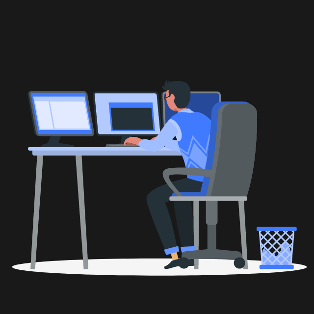

  

<lottie-player src="https://assets2.lottiefiles.com/packages/lf20_cmaqoazd.json"  background="transparent"  speed="1"  style="width: 300px; height: 300px;"  loop controls autoplay></lottie-player>
- 👋 Hi, I’m Sai Ram. I am a Computer Science Student currently in my third year.
- 👀 I’m fascinated by Machine Learning and Data Science and would love to pursue a career in this domain.
- 🌱 I’m currently working on personal projects that can be put forth on my resume.
- 📫 You can reach me through my [LinkedIn](https://www.linkedin.com/in/am-ram/)
 

  

<!-- - 💞️ I’m looking to collaborate on ... -->

<!---
am-ram/am-ram is a ✨ special ✨ repository because its `README.md` (this file) appears on your GitHub profile.
You can click the Preview link to take a look at your changes.
--->
